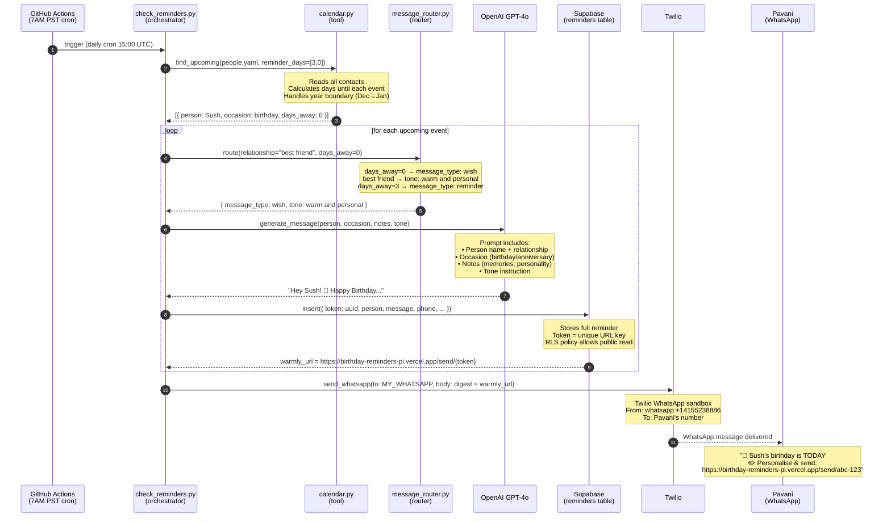
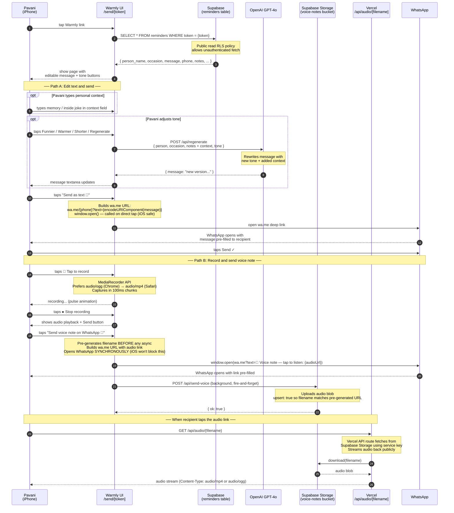

# BirthdayReminders + Warmly — System Flow

Two sequence diagrams: the automated daily engine, and the Warmly editing experience.

---

## Part 1 — Daily Reminder Engine

Runs automatically every day at 7AM Pacific via GitHub Actions.

---

## Part 2 — Warmly (Edit & Send)

Triggered when Pavani taps the Warmly link in her WhatsApp digest.

---

## Key Design Decisions

| Decision | Why |
|---|---|
| YAML not a database | Zero infrastructure, version controlled, readable |
| GitHub Actions not a server | Free scheduler, no uptime to manage |
| Supabase token lookup | Stateless URL — no session, no auth needed |
| `window.open` before `await` | iOS Safari blocks popups after async — must open on direct tap |
| Audio proxied through Vercel | Supabase direct URLs blocked by RLS; Vercel URL always public |
| `NEXT_PUBLIC_WARMLY_URL` not `VERCEL_URL` | `VERCEL_URL` = deployment-specific (Vercel-protected); production URL is always public |
| Twilio sandbox → owner only | Recipients must opt-in; fine for personal use; upgrade to WhatsApp Business API for others |
| `audio/ogg` preferred over `audio/webm` | WhatsApp supports ogg + mp4; rejects webm |
